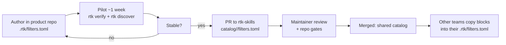

# Contributing to rtk-skills

This toolkit is how ECI rolls out [RTK (Rust Token Killer)](https://www.rtk-ai.app/) — the token-reduction layer that cuts AI-agent token spend 60–90% on CLI output. Most contributions fall into two buckets:

1. **Skill / rule / script changes** — core toolkit behavior (rare; needs Claude ↔ Cursor parity).
2. **Filter promotion** — the common path: a team proves a filter in their product repo, then promotes it to the shared [`catalog/`](catalog/).

This document focuses on the second path, because that is the feedback loop that keeps the whole rollout honest: **local discoveries must flow back to the central repo so every team benefits.**

## The two-tier filter model

Filters do **not** start in this repo. They start where the toolchain runs every day.



| Tier | Location | Owner | When |
|------|----------|-------|------|
| **1. Team filter** | `<product-repo>/.rtk/filters.toml` | The product team | First — author, iterate, prove |
| **2. Shared filter** | `catalog/<team>/filters.toml` | Maintainer review | After the pilot proves it |

A central catalog of unproven filters is just a junk drawer. Promote only what earned it.

## Promote workflow (the answer to "filters won't be shared back")

1. **Author in the product repo.** Edit `<product-repo>/.rtk/filters.toml` using the 0.43.x schema (see [`catalog/_template/filters.toml`](catalog/_template/filters.toml) or [`examples/filters.toml`](examples/filters.toml)). Every filter **must** include at least one inline `[[tests.<name>]]` case.
2. **Validate locally.**
   ```bash
   rtk verify                 # runs the inline tests + hook integrity
   ```
3. **Commit and trust.**
   ```bash
   git add .rtk/filters.toml && git commit -m "rtk: add <name> filter"
   rtk trust                  # honor project-local filters (0.43.x security gate)
   ```
4. **Pilot for ~1 week.** Work normally. Confirm the filter is firing (`rtk discover` should stop listing that command as a miss) and that no one reports "RTK ate my output." If a teammate loses detail they needed, read the tee log path RTK printed on the failure (`~/.local/share/rtk/tee/` on Linux/macOS/WSL; `%LOCALAPPDATA%\rtk\tee\` on native Windows) and **loosen the filter before promoting**.
5. **Open a PR to `rtk-skills`.**
   - Add `catalog/<team>/filters.toml` (create the `<team>/` folder if it is new). One filter per `[filters.<name>]` block, each with its `[[tests.*]]`.
   - Add or update one row in the [filter index](catalog/README.md#filter-index): `filter name`, `match_command`, `team`, `source repo / PR`, `status`, `notes`.
   - In the PR description, include: the command being filtered, 2–3 real output samples (success + failure), and the expected token savings.
6. **Maintainer review.** A maintainer runs the repo gates and merges:
   ```bash
   ./scripts/validate.sh        # structure + artifacts (no RTK needed)
   ./scripts/check-parity.sh    # Claude skills ↔ Cursor rules agree
   ./scripts/check-links.sh     # http(s) links resolve
   ```
7. **Other teams adopt it** by copying the `[filters.<name>]` block (and its tests) into their own `.rtk/filters.toml`, then `rtk trust`.

## Filter authoring checklist

Before opening a PR, every filter must satisfy:

- [ ] **Schema:** `[filters.<name>]` (0.43.x). No legacy `[[filter]]` — `check-parity.sh` and `validate.sh` reject it.
- [ ] **`match_command`** is a regex anchored to the command that actually produces the output (e.g. `^mybuild\b`). Verify it does not accidentally match a different command.
- [ ] **Inline tests:** at least one `[[tests.<name>]]` with a descriptive `name`, a real `input` sample, and the exact `expected` filtered output. Cover both a success and a failure case where it matters.
- [ ] **Failure-path preserved:** a failing assertion, error, or stack trace is still identifiable in the filtered output (or recoverable via the tee log). This is the non-negotiable safety rule.
- [ ] **`on_empty` set:** a short fallback message so an all-green run prints something useful instead of blank output.
- [ ] **`strip_ansi = true`** if the command emits color codes.
- [ ] **No secrets in samples:** scrub credentials, connection strings, and customer data from any `input`/`expected` you commit.

## Safety rule

> When in doubt, keep failure-path information and cut success-path verbosity.

A filter that hides a passing test costs nothing. A filter that hides a failing assertion costs trust — and a disabled RTK saves zero tokens. If a filter is ever suspected of hiding something an agent needed, fix it fast (or add the command to `[hooks] exclude_commands`) rather than letting the team abandon RTK.

## Skill / rule / script changes (less common)

These touch the three-layer model and can drift between Claude skills and Cursor rules. When you change one, change its pair and re-run the gates:

1. Edit the Claude skill (`.claude/skills/rtk-*/SKILL.md`) **and** its Cursor rule (`cursor-rtk/.cursor/rules/*.mdc`) together — they must agree on RTK facts (init flags, config paths, tee recovery, `exclude_commands`, Read/Grep/Glob bypass).
2. If RTK behavior changed, update `RTK_VERSION` + the filter schema references in `examples/filters.toml` and `.rtk/filters.toml` together.
3. Rebuild portable zips: `./scripts/pack-skills.sh`.
4. Run the gates before pushing:
   ```bash
   ./scripts/validate.sh
   ./scripts/check-parity.sh
   ./scripts/check-links.sh
   ./scripts/pack-skills.sh
   ```
5. `check-parity.sh` fails the build if the skill/rule pair drifts — fix the drift, do not silence it.

## RTK version pinning

This toolkit pins one RTK version in [`RTK_VERSION`](RTK_VERSION) (currently 0.43.0). Treat a bump like a dependency upgrade: pilot on one repo, watch `rtk gain --daily` and team channels for a few days, then roll out. Bumping `RTK_VERSION` triggers the CI `full` job, which installs the pinned RTK and runs `validate.sh --full`.

## Questions

- Filter authoring / troubleshooting: the `rtk-operations` skill (`"Run the rtk-operations skill"`).
- Setup / adoption: the `rtk-adoption` skill, or `./scripts/adopt.sh --dry-run`.
- Baseline a machine before changes: the `rtk-audit` skill.
